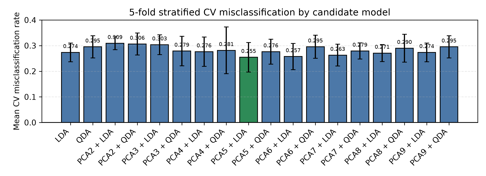

---
format:
  pdf:
    documentclass: article
    fontsize: 8pt
    geometry:
      - top=0.45in
      - bottom=0.45in
      - left=0.55in
      - right=0.55in
    toc: false
    number-sections: false
    colorlinks: true
    include-in-header:
      text: |
        \usepackage{array}
        \setlength{\tabcolsep}{4pt}
        \renewcommand{\arraystretch}{0.9}
        \AtBeginDocument{\small}
---

# LDA/QDA analysis for the SAheart dataset

The binary response was `chd`; predictors were `sbp, tobacco, ldl, adiposity, famhist, typea, obesity, alcohol, age`, with `famhist` coded as `Absent = 1` and `Present = 2`. A stratified 20% test split was reserved before selection using seed 432, leaving 369 training observations and 93 test observations. All 18 candidate LDA/QDA models were evaluated with the same 5-fold stratified CV assignments on the training data; preprocessing was fit only on each training fold.

{fig-align="center" width=82%}

## CV comparison

All 18 candidates were evaluated; the table below reports the top models and the two ordinary baselines.

| Candidate | Mean CV error | SD |
|---|---:|---:|
| LDA | 0.2736 | 0.0364 |
| QDA | 0.2952 | 0.0431 |
| PCA5 + LDA | 0.2545 | 0.0576 |
| PCA6 + LDA | 0.2573 | 0.0509 |
| PCA7 + LDA | 0.2628 | 0.0426 |
| PCA3 + QDA | 0.2789 | 0.0577 |
| PCA4 + LDA | 0.2762 | 0.0569 |
| PCA5 + QDA | 0.2763 | 0.0486 |

## Selected model and test performance

The selected model was PCA5 + LDA, with the lowest mean 5-fold CV misclassification rate of 0.2545. The final held-out test result for this model was 23/93 misclassified, corresponding to a test misclassification rate of 0.2473.

Confusion matrix on the reserved test set (rows = observed, columns = predicted):

| Obs \ Pred | 0 | 1 |
|---|---:|---:|
| 0 | 52 | 9 |
| 1 | 14 | 18 |

## Findings and limitations

PCA5 + LDA delivered the best cross-validated predictive performance among the considered LDA/QDA-based candidates, slightly improving over ordinary LDA. This suggests a modest gain from dimensionality reduction before classification, although the improvement is small relative to the overall classification difficulty.

The main limitations are the single 80/20 random split, the modest sample size, and the fact that preprocessing and model selection were based only on the training set. The held-out score should therefore be interpreted as an estimate rather than a guarantee of future performance.
